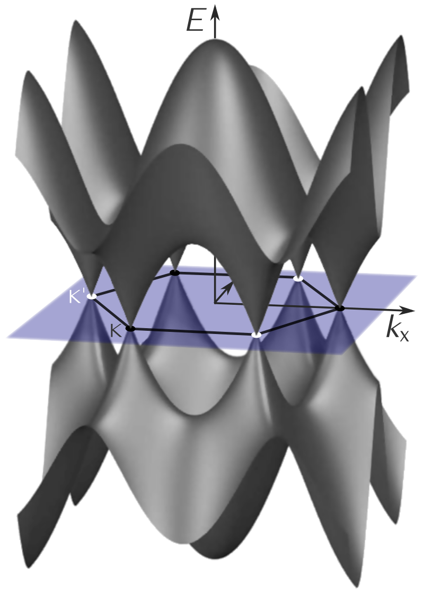

#Graphene Topics


1. What is graphene?

2. The structure of graphene

3. The electronic property of graphene


---

# What is graphene?


.pull-left[
**Graphite**

```{r echo = FALSE, out.width = '60%'}
knitr::include_graphics("imgs/graphite.jpg")
```
]

.pull-right[
**Graphene**

```{r echo = FALSE, out.width = '140%'}
knitr::include_graphics("imgs/graphene1.jpg")
```

]

###Graphene is a carbon allotrope consisting of a single layer of atoms.
---
#The structure of graphene


.pull-left[


```{r echo = FALSE, out.width = '100%'}
knitr::include_graphics("imgs/graphene2.jpg")
```
]

.pull-right[


```{r echo = FALSE,out.width = '60%'}
knitr::include_graphics("imgs/spm.jpg")
```

]
####Graphene is a single layer of two-dimensional atomic crystals with an orthohexagonal lattice structure. The length of the C–C bond is around 0.142 nm, and the thickness of the layer is 0.35 nm.
---
#The electronic property of graphene


###The dispersion relation of graphene

$$E(k_x,k_y)=\pm\,\gamma_0\sqrt{1+4\cos^2{\tfrac{1}{2}ak_x}+4\cos{\tfrac{1}{2}ak_x} \cdot \cos{\tfrac{\sqrt{3}}{2}ak_y}}$$
.center[
```{r echo = FALSE,out.width = '30%'}

```
]
