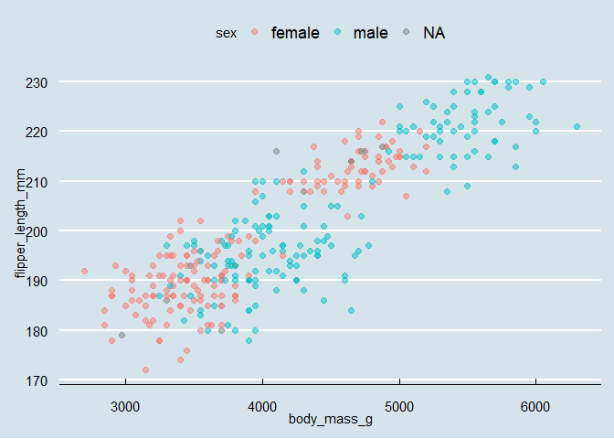

Lab4_question_7\_github_document
================
He Ma
2022-09-27

## R Markdown

This is an R Markdown document. Markdown is a simple formatting syntax
for authoring HTML, PDF, and MS Word documents. For more details on
using R Markdown see <http://rmarkdown.rstudio.com>.

When you click the **Knit** button a document will be generated that
includes both content as well as the output of any embedded R code
chunks within the document. You can embed an R code chunk like this:

``` r
economist_scatter <- function(data, x, y, colour_by){
   
    { if (!is.data.frame(data)){
      stop("Can only compute dataframe.")
    }
 }     

    

library(ggthemes)
ggplot(data, aes(x = {{x}}, y = {{y}})) +
    geom_point(alpha = 0.5, size = 2, aes(colour = {{colour_by}})) +
    theme_economist()
   
}

economist_scatter(penguins, body_mass_g, flipper_length_mm, sex)
```

    ## Warning: Removed 2 rows containing missing values (geom_point).

<!-- -->

## Including Plots

You can also embed plots, for example:

<!-- -->

Note that the `echo = FALSE` parameter was added to the code chunk to
prevent printing of the R code that generated the plot.
